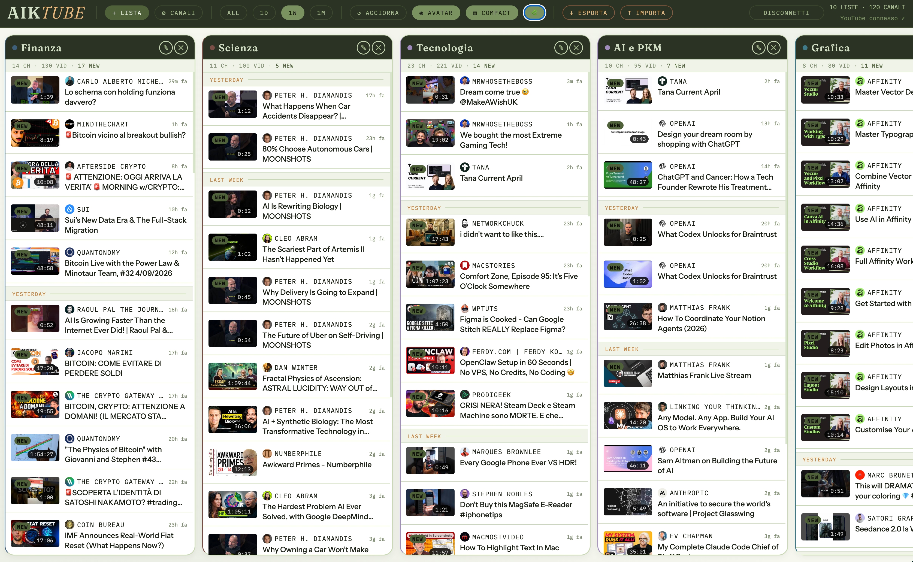

# AikTube

**AikTube is a self-hosted, TweetDeck-style YouTube dashboard for people who are tired of YouTube's interface.**

Instead of an algorithmically curated feed full of distractions, AikTube gives you a clean set of vertical columns — one per topic — each showing only the latest videos from the channels you actually care about. You decide what goes where.




---

## What it does

- **Custom lists** — create named columns (Finance, Tech, Science, Design…) and assign any of your subscribed channels to them
- **Clean feed** — videos sorted by publish date, newest on top, no recommendations, no ads, no distractions
- **Time filters** — ALL / 1D / 1W / 1M; default is 1W; choice is saved across sessions
- **Inline player** — click any video to watch it inside AikTube; automatically falls back to YouTube if embeds are disabled
- **Reels/Shorts detection** — short videos (≤60s) with vertical thumbnails are automatically flagged with a REEL badge; the player switches to 9:16 aspect ratio for them
- **Per-channel reel auto-dismiss** — in the Channels panel you can hide Shorts/Reels automatically for specific channels
- **Dismiss** — hover any video thumbnail and click ✓ to dismiss it globally across all lists; a ✓ Dismiss button is also available inside the player; dismissed videos are persisted with a 90-day TTL (auto-cleaned on load); an UNDO toast appears for 4 seconds after each dismiss (session only, up to 20 steps)
- **Compact mode** — row layout: small thumbnail on the left, channel + title on the right; hover expands the thumbnail inline, pushing the text below; columns widen automatically
- **Forest theme** — a light, rounded skin with forest tones; active by default
- **Channel avatars** — show channel icons on video cards
- **Export / Import** — save your lists as a portable JSON file; load on any browser
- **Smart caching** — videos cached 30 min, subscriptions 6 hours; manual refresh always available
- **Installable app shell** — can be installed as a PWA for a dedicated desktop-style window and app icon

AikTube runs entirely on your own machine. No server, no account, no tracking. Your credentials stay on your computer.

---

## Interface

| Button | Action |
|---|---|
| **+ List** | Create a new column |
| **⚙ Channels** | Browse all subscriptions; assign to lists; toggle unassigned-only view |
| **ALL / 1D / 1W / 1M** | Time filter (default: 1W) |
| **↺ Refresh** | Force re-fetch subscriptions and videos |
| **◉ Avatar** | Toggle channel avatar icons on cards |
| **▤ Compact** | Toggle compact row layout with expandable thumbnails |
| **🌿** | Toggle Forest theme (default: on) |
| **↓ Export** | Download lists as JSON |
| **↑ Import** | Load lists from JSON |
| **Connect YT / Disconnect** | OAuth login/logout |
| **✓ on thumbnail** | Dismiss a video globally (hidden everywhere, 90-day TTL, UNDO available for 4s) |
| **ESC** | Close the player or any open modal |
| **F** | Fullscreen the player |

All toggle states (theme, compact, avatars, time filter) are saved and restored on next load.

---

## How it works

AikTube is a single HTML file (`AikTube.html`) served by a small local Node.js server (`server.js`).

The server handles two things:
1. **OAuth** — manages the Google login flow server-side; your token is never exposed in the browser
2. **YouTube API proxy** — all API requests go through the server, which adds the token automatically

```
Browser (AikTube.html)
        ↕  localhost:51847
Local server (server.js)
        ↕  HTTPS
Google YouTube Data API v3
```

---

## Requirements

- **Node.js v18+** — [nodejs.org](https://nodejs.org)
- **A Google account** with YouTube subscriptions
- Brave, Chrome, or any modern browser

No npm packages needed — `server.js` uses only Node.js built-ins.

---

## Quick start

### 1. Start the server

```bash
cd path/to/AikTube
node server.js
```

Open **http://localhost:51847** in your browser. Keep the terminal open.

Or use the launcher script:

```bash
chmod +x aiktube.sh   # only needed once
./aiktube.sh          # start server + open browser
./aiktube.sh stop     # stop the server
```

If the wrong browser opens, edit the `open -a "Brave Browser"` line in `aiktube.sh`.

### 2. Google OAuth setup (one time)

#### Step 1 — Create a Google Cloud project

1. [console.cloud.google.com](https://console.cloud.google.com) → project dropdown → **New Project** → name it `AikTube` → **Create**

#### Step 2 — Enable YouTube Data API v3

**APIs & Services** → **Library** → search `YouTube Data API v3` → **Enable**

#### Step 3 — OAuth consent screen

1. **APIs & Services** → **OAuth consent screen**
2. User type: **External** → **Create**
3. Fill in app name (`AikTube`) and your email; save through all steps
4. On the dashboard: **Publish App** → **Confirm**

> Publishing removes the test-mode restriction so your account can log in. AikTube is not submitted to any app store.

#### Step 4 — Create OAuth credentials

1. **Credentials** → **+ Create Credentials** → **OAuth client ID**
2. Application type: **Web application**
3. **Authorized redirect URIs** → add exactly:
   ```
   http://localhost:51847/api/auth/callback
   ```
4. **Create** → copy **Client ID** and **Client Secret**

#### Step 5 — Connect AikTube

1. Open [http://localhost:51847](http://localhost:51847)
2. Paste Client ID and Client Secret into the setup screen
3. **Save & Connect** → sign in with Google → **Allow**

Done. AikTube loads your subscriptions and you can start building lists.

---

## API quota

Free tier: **10,000 units/day**, resets at midnight Pacific (09:00 CET).

| Action | Units |
|---|---|
| Load subscriptions (up to 500) | ~1–10 |
| Load videos for one channel | 3 |
| Full refresh with N channels | ~3×N |

Avoid pressing **↺ Refresh** repeatedly — each press re-fetches all channels in your lists.

---

## Your data

Lists and settings are in the browser's `localStorage`.

- **↓ Export** — saves `aiktube-YYYY-MM-DD.json`
- **↑ Import** — loads lists on any browser

---

## File structure

```
AikTube/
├── AikTube.html          — entire frontend (single file)
├── server.js             — local Node.js server: OAuth + API proxy
├── index.html            — OAuth callback redirect handler
├── aiktube.sh            — launcher script
├── .gitignore            — ignores local secrets and macOS metadata
└── aiktube-config.json   — auto-created; your OAuth credentials
                            DO NOT share or commit this file
```

---

## Security

- Server listens on `localhost` only
- API requests are accepted only from the local app, with local-request checks on protected routes
- OAuth token is stored server-side in `aiktube-config.json`, never sent to the browser
- `aiktube-config.json` is blocked from static file serving
- `.gitignore` already excludes `aiktube-config.json`

---

## Limitations

- Read-only — AikTube cannot like, comment, or post
- If a channel disables embeds, AikTube opens the video on YouTube instead
- Desktop web app only — no mobile version
